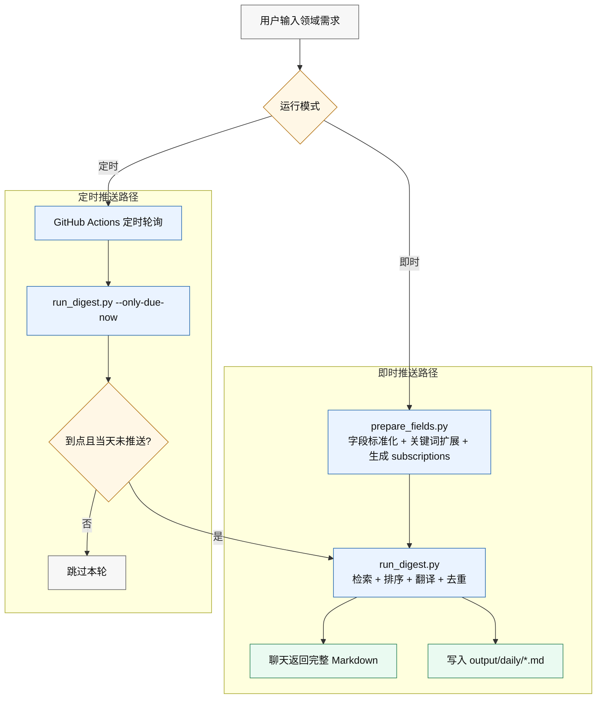

# agent-daily-paper

`agent-daily-paper` 用于按研究领域聚合 arXiv 最新论文，并支持定时推送与即时推送两种运行模式。

核心能力：
- 多领域订阅与每领域独立数量上限（5-20）
- 输出英文标题、中文标题、英文摘要、中文摘要、arXiv 链接
- `NEW/UPDATED` 标记与 Markdown 归档
- 定时推送（GitHub Actions）
- 即时推送（命令行触发，不依赖 Actions）

## 运行流程图（Academic Style）



## 首次配置

订阅配置至少包含：
- `field_settings[].name`
- `field_settings[].limit`（5-20）
- `push_time`（HH:MM）
- `timezone`（例如 `Asia/Shanghai`）

## 环境准备（Conda）

```bash
conda create -n arxiv-digest-lab python=3.10 -y
conda activate arxiv-digest-lab
pip install argostranslate
python -c "from argostranslate import package; package.update_package_index(); p=[x for x in package.get_available_packages() if x.from_code=='en' and x.to_code=='zh'][0]; package.install_from_path(p.download())"
```

翻译提供方：
- `TRANSLATE_PROVIDER=argos`（离线）
- `TRANSLATE_PROVIDER=openai`（需 `OPENAI_API_KEY`）
- `TRANSLATE_PROVIDER=auto`
- `TRANSLATE_PROVIDER=none`

## 即时推送（不依赖 GitHub Actions）

### 一键执行

```bash
python scripts/instant_digest.py --fields "数据库优化器,推荐系统" --limit 20 --time-window-hours 72
```

默认会读取 `config/agent_field_profiles.json`（若存在）作为 Agent 字段画像输入。

### 分步执行

```bash
python scripts/prepare_fields.py --fields "数据库优化器" --limit 20 --output config/subscriptions.instant.json
python scripts/run_digest.py --config config/subscriptions.instant.json --emit-markdown
```

## Agent 字段画像输入（可选）

支持将 Agent 生成的领域画像 JSON 输入到 `prepare_fields.py`。默认路径为 `config/agent_field_profiles.json`。

```json
{
  "数据库优化器": {
    "canonical_en": "database query optimizer",
    "categories": ["cs.DB"],
    "keywords": ["database", "query optimizer", "execution plan", "cost model", "cardinality estimation"],
    "title_keywords": ["optimizer", "query", "cost model"],
    "venues": ["SIGMOD", "VLDB", "ICDE", "PODS"]
  }
}
```

运行命令：

```bash
python scripts/prepare_fields.py --fields "数据库优化器" --profiles-json config/agent_field_profiles.example.json --output config/subscriptions.instant.json
python scripts/run_digest.py --config config/subscriptions.instant.json --emit-markdown
```

## 定时推送（GitHub Actions）

工作流文件：`.github/workflows/daily-digest.yml`

机制：
- 每 10 分钟轮询触发
- 执行 `run_digest.py --only-due-now --due-window-minutes 15`
- 仅在到点窗口执行，且同订阅每天只推送一次
- 有变更时自动提交 `output/daily` 与 `data/state.json`

## 关键文件

- `scripts/run_digest.py`：抓取、排序、翻译、归档
- `scripts/prepare_fields.py`：领域输入转订阅配置
- `scripts/instant_digest.py`：即时推送入口
- `config/subscriptions.json`：长期订阅配置（生产）
- `config/subscriptions.examples.json`：示例订阅集合（参考模板）
- `config/agent_field_profiles.json`：Agent 字段画像输入（默认读取，建议按需维护）
- `config/agent_field_profiles.example.json`：字段画像示例模板
- `output/daily/`：每日归档目录
