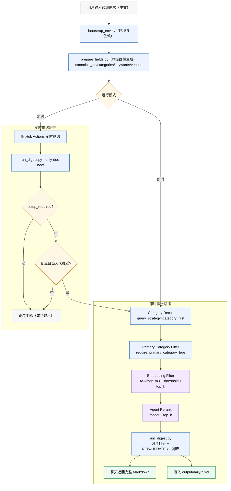

# agent-daily-paper

`agent-daily-paper` 用于按研究领域聚合 arXiv 最新论文，并支持定时推送与即时推送两种运行模式。

## 给 Agent 的一句话安装指令

可以直接对 Agent 说：

`帮我安装 https://github.com/Ricardo-Ping/agent-daily-paper.git 这个 skill，然后安装 arxiv-digest-lab 虚拟环境，并进行初始化设置。`

核心能力：
- 多领域订阅与每领域独立数量上限（5-20）
- 输出英文标题、中文标题、英文摘要、中文摘要、arXiv 链接
- 日报头部输出领域画像：英文领域名、关键词、相关会议/期刊
- `NEW/UPDATED` 标记与 Markdown 归档
- 定时推送（GitHub Actions）
- 即时推送（命令行触发，不依赖 Actions）

## 运行流程图（Academic Style）



## 首次配置

默认 `config/subscriptions.json` 为“未初始化锁定态”（`setup_required=true`），不会直接推送。
必须先收集用户配置并写入真实订阅，再运行。

订阅配置至少包含：
- `field_settings[].name`
- `field_settings[].limit`（5-20）
- `push_time`（HH:MM）
- `timezone`（例如 `Asia/Shanghai`）

## 环境准备（Conda）

推荐安装 skill 后先执行一键初始化（自动建环境、装依赖、装 Argos 模型、初始化配置）：

```bash
python scripts/bootstrap_env.py --run-doctor
```

等价手动步骤：

```bash
conda create -n arxiv-digest-lab python=3.10 -y
conda activate arxiv-digest-lab
pip install argostranslate sentence-transformers
python scripts/install_argos_model.py
python scripts/install_embedding_model.py --model BAAI/bge-m3
```

翻译提供方：
- `TRANSLATE_PROVIDER=argos`（离线）
- `TRANSLATE_PROVIDER=openai`（需 `OPENAI_API_KEY`）
- `TRANSLATE_PROVIDER=auto`
- `TRANSLATE_PROVIDER=none`

## 健康检查（推荐先跑）

```bash
python scripts/doctor.py
```

检查项：
- `config/subscriptions.json` 与 `data/state.json` 是否存在且可解析
- 订阅配置字段完整性（`push_time`、`timezone`、`field_settings`、`limit`）
- `config/agent_field_profiles.json` 格式
- Argos 依赖与语言包状态
- arXiv 网络连通性
- GitHub Actions 工作流关键步骤

## 即时推送（不依赖 GitHub Actions）

### 一键执行

```bash
python scripts/instant_digest.py --fields "数据库优化器,推荐系统" --limit 20 --time-window-hours 72
```

默认读取 `config/agent_field_profiles.json` 作为 Agent 字段画像输入（首次安装后应完成该文件配置）。
默认输出“完整 Markdown 正文到聊天（与 `output/daily/*.md` 文件内容一致）”，并同时落盘到 `output/daily/*.md`。

### 分步执行

```bash
python scripts/prepare_fields.py --fields "数据库优化器" --limit 20 --output config/subscriptions.instant.json
python scripts/run_digest.py --config config/subscriptions.instant.json --emit-markdown
```

## Agent 字段画像输入（默认启用）

`prepare_fields.py` 默认使用 `config/agent_field_profiles.json`，建议作为标准配置文件长期维护。

```json
{
  "数据库优化器": {
    "canonical_en": "database query optimizer",
    "categories": ["cs.DB"],
    "keywords": ["database", "query optimizer", "execution plan", "cost model", "cardinality estimation"],
    "title_keywords": ["optimizer", "query", "cost model"],
    "venues": ["SIGMOD", "VLDB", "ICDE", "PODS"]
  }
}
```

运行命令（默认路径）：

```bash
python scripts/prepare_fields.py --fields "数据库优化器" --profiles-json config/agent_field_profiles.json --output config/subscriptions.instant.json
python scripts/run_digest.py --config config/subscriptions.instant.json --emit-markdown
```

首次可通过模板初始化：

```bash
cp config/agent_field_profiles.example.json config/agent_field_profiles.json
```

```powershell
Copy-Item config/agent_field_profiles.example.json config/agent_field_profiles.json
```

## 相关性漏斗（推荐）

推荐启用四层过滤：
1. `query_strategy=category_first`（先按 arXiv 分类召回）
2. `require_primary_category=true`（仅保留主分类命中）
3. `embedding_filter`（本地向量相似度过滤）
4. `agent_rerank`（Agent/LLM 语义重排）

`subscriptions.json` 示例：

```json
{
  "query_strategy": "category_first",
  "require_primary_category": true,
  "embedding_filter": {
    "enabled": true,
    "model": "BAAI/bge-m3",
    "threshold": 0.58,
    "top_k": 120
  },
  "agent_rerank": {
    "enabled": true,
    "model": "gpt-4.1-mini",
    "top_k": 40
  }
}
```

## 定时推送（GitHub Actions）

工作流文件：`.github/workflows/daily-digest.yml`

机制：
- 每 10 分钟轮询触发
- 执行 `run_digest.py --only-due-now --due-window-minutes 15`
- 仅在到点窗口执行，且同订阅每天只推送一次
- 有变更时自动提交 `output/daily` 与 `data/state.json`

翻译说明：
- GitHub Actions 运行在临时环境，若未配置 `OPENAI_API_KEY`，通常会出现 `[待翻译]`。
- 建议在仓库 Secrets 中配置 `OPENAI_API_KEY`，并将 `TRANSLATE_PROVIDER` 设为 `openai` 或 `auto`。
- 本地离线运行可用 Argos：先执行 `python scripts/install_argos_model.py`。

## 关键文件

- `scripts/run_digest.py`：抓取、排序、翻译、归档
- `scripts/prepare_fields.py`：领域输入转订阅配置
- `scripts/instant_digest.py`：即时推送入口
- `config/subscriptions.json`：长期订阅配置（生产）
- `config/subscriptions.examples.json`：示例订阅集合（参考模板）
- `config/agent_field_profiles.json`：Agent 字段画像输入（默认读取，建议按需维护）
- `config/agent_field_profiles.example.json`：字段画像示例模板
- `output/daily/`：每日归档目录
